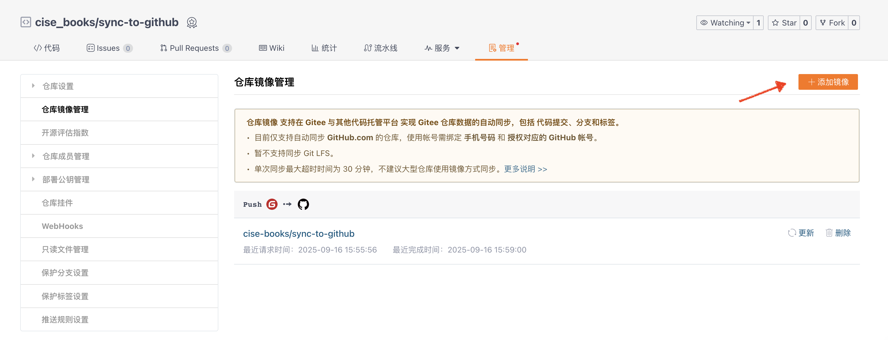
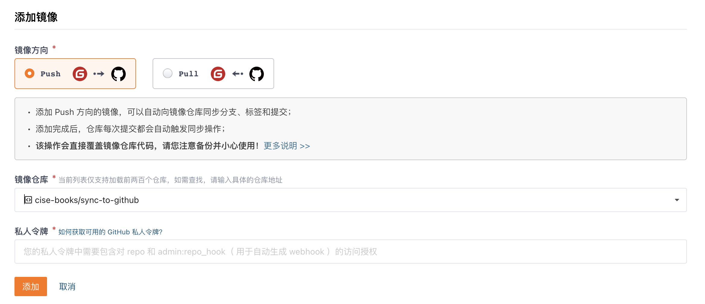

# sync-to-github

本章节主要介绍如何将 gitee 仓库同步到 github。

配置完成后，一个典型的工作流是：

1. 在本地进行编辑，push 修改到 gitee 仓库；
2. 在https://gitee.com/cise_books/<repo>/mirrors#/ 中查看同步状态；
3. 在https://cise-books.github.io/<repo>/ 中查看部署的内容。

## gitee 侧

1. 在`cise-books`组织下新建仓库`repo`。
2. 仓库中的内容需按照如下方式组织：

```
repo/
├── .github/
│   └── workflows/
│       └── deploy.yml # 复制.github/workflows/deploy.yml，用于自动化地生成`mdbook`的编译结果/制品
├── book.toml          # `mdbook init`初始化的mdbook项目配置文件
├── src/               # `mdbook init`初始化的mdbook项目源码
│   ├── chapter_1.md
│   └── ...
└── SUMMARY.md         # `mdbook init`初始化的mdbook项目目录结构文件
```

3. 配置仓库镜像管理 -> 添加镜像



4. 添加镜像页做如下配置
    1. 镜像方向选择 push
    2. 镜像仓库选择在 github 上对应的仓库
    3. 在 github 上生成私人令牌，注：除要求的`repo`和`admin:repo_hook`权限外，还需添加`workflow`权限



## github 侧

1. 在`cise-books`组织下新建仓库`repo`。
2. Settings -> Build and deployment -> 选择 Deploy from a branch -> Branch 选择 gh-pages -> Save。
